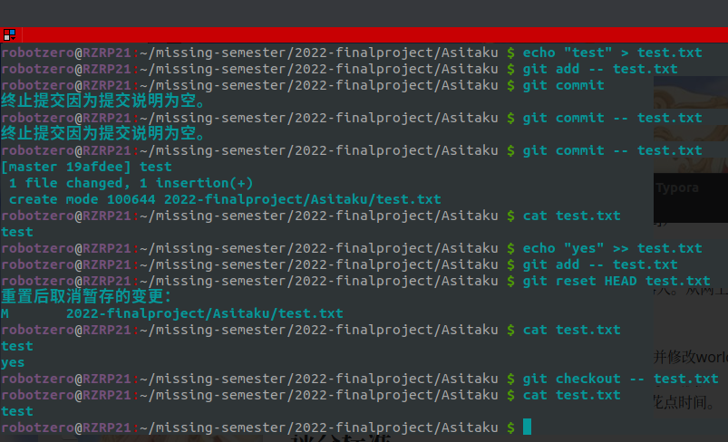
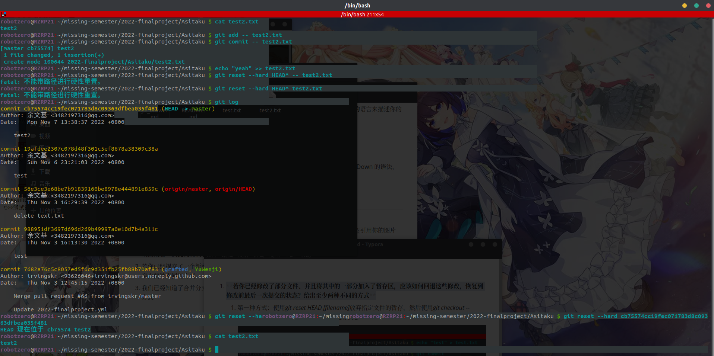
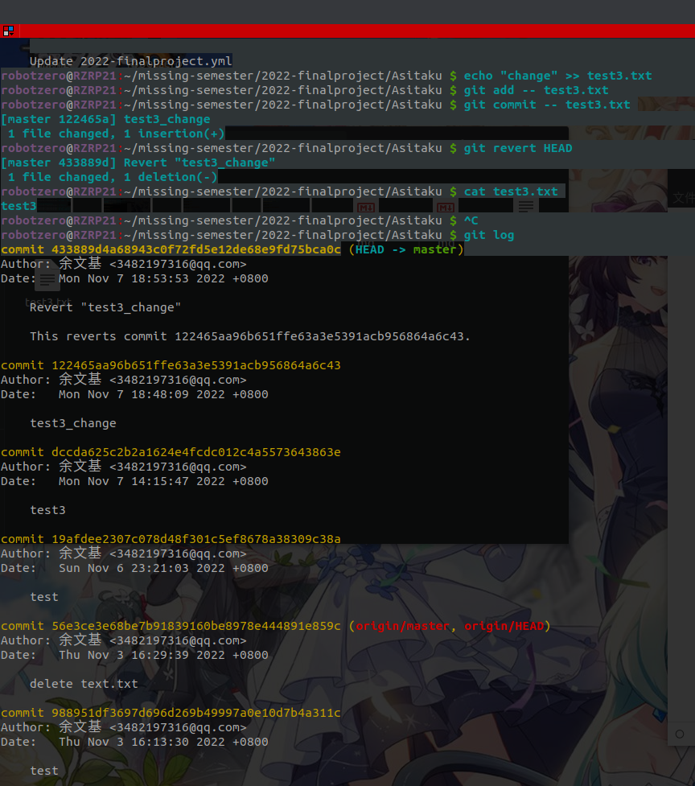
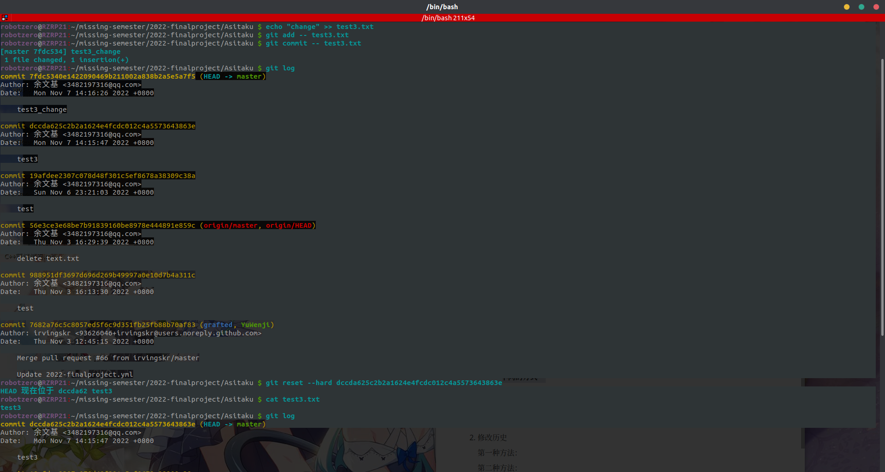
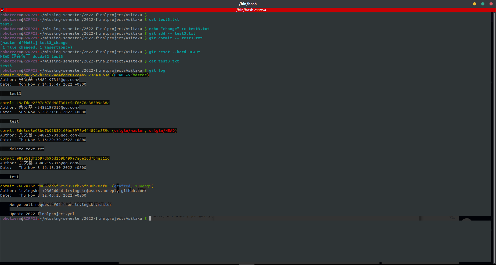
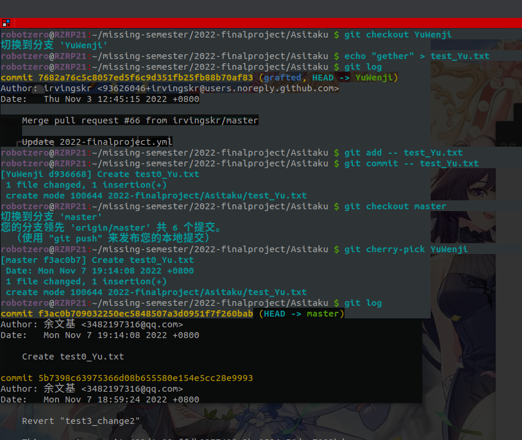
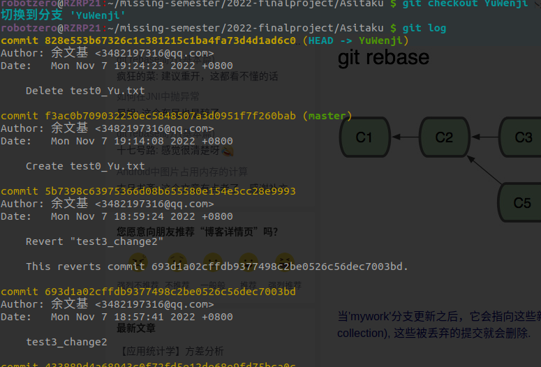

1. **若你已经修改了部分文件、并且将其中的一部分加入了暂存区，应该如何回退这些修改，恢复到修改前最后一次提交的状态？给出至少两种不同的方式**

   1. 第一种方式：使用_git reset HEAD [filename]_放弃指定文件的暂存，然后使用_git checkout -- [filename]_放弃文件修改，回到最近提交的状态

      

   2. 第二种方法：先使用_git log_获得commit id使用_git reset --hard [commit id]_

      

2. **若你已经提交了一个新版本，需要回退该版本，应该如何操作？分别给出不修改历史或修改历史的至少两种不同的方式**

   1. 不修改历史

      第一种方法：_git revert HEAD_

      

      第二种方法：_git revert [commit id]_

      

   2. 修改历史

      第一种方法：_git reset --hard [commit id]_

      

      第二种方法：_git reset --hard HEAD^_

      
      
      

3. **我们已经知道了合并分支可以使用 merge，但这不是唯一的方法，给出至少两种不同的合并分支的方式**

   1. 第一种方法：

      _git checkout [需要被合并到的分支]_

      _git cherry-pick [需要合并到其它分支的分支]_

      

      2. 第二种方法：

         _git rebase [要合并到其它分支的分支] [被合并的分支]_

         

          