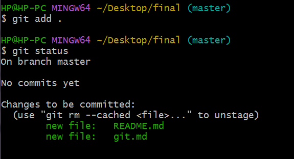
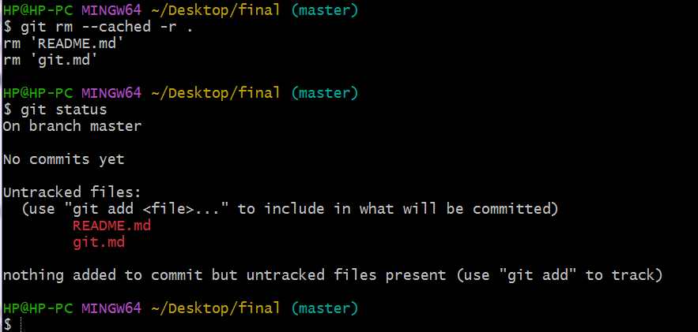
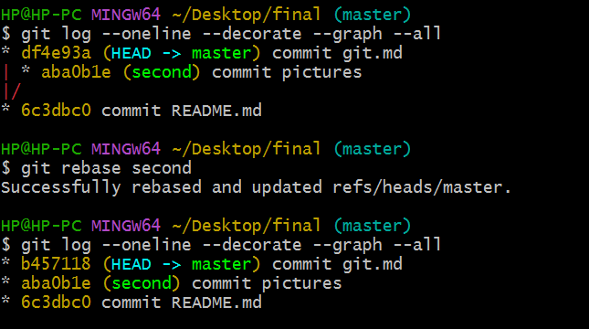

1. 若你已经修改了部分文件、并且将其中的一部分加入了暂存区，应该如何回退这些修改，恢复到修改前最后一次提交的状态？给出至少两种不同的方式

   

   

   若只想删除指定的某几个文件，可以使用`git rm --cached <file>`一个个删。

2. 若你已经提交了一个新版本，需要回退该版本，应该如何操作？分别给出不修改历史或修改历史的至少两种不同的方式

   

   

   revert 方法不修改历史，reset 方法修改历史

3. 我们已经知道了合并分支可以使用 merge，但这不是唯一的方法，给出至少两种不同的合并分支的方式

   
   
   
