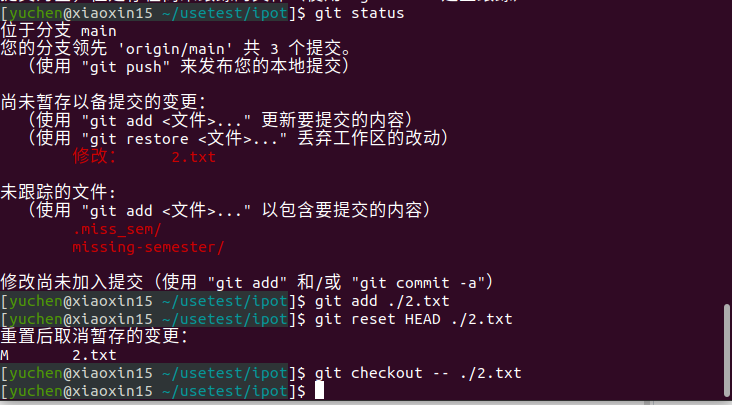
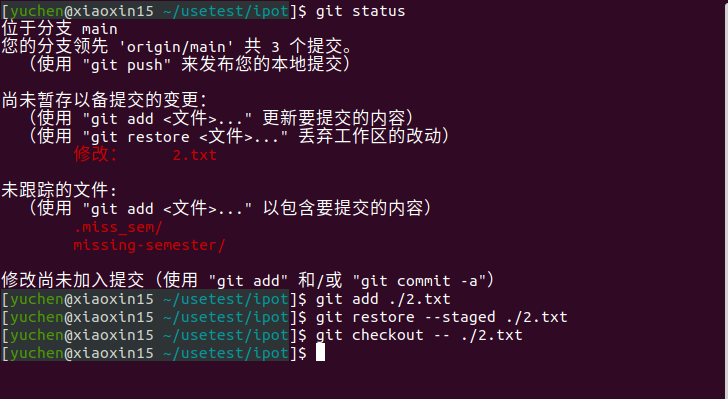
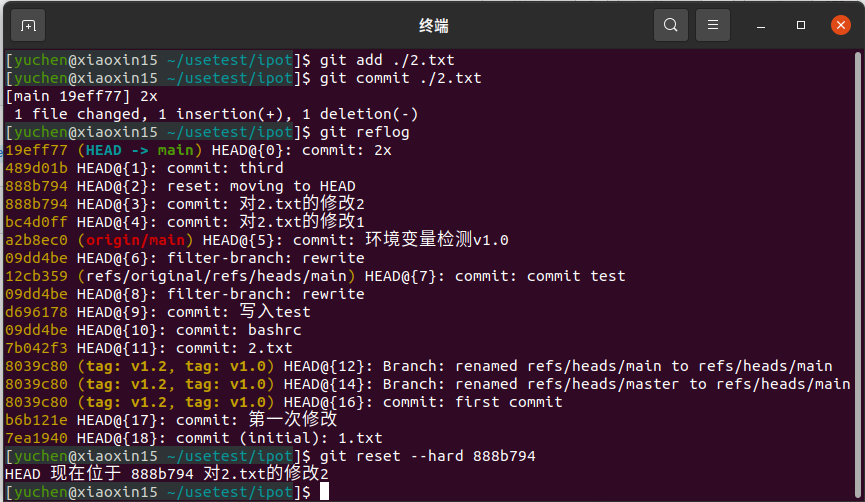
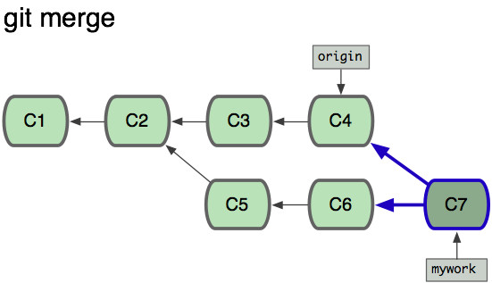
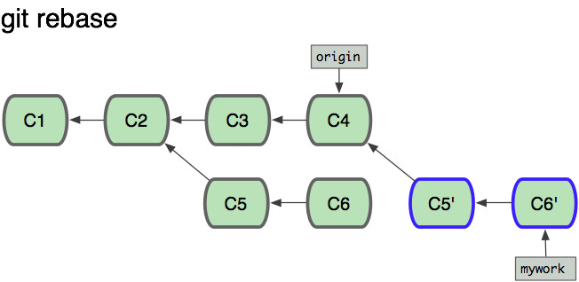

# Git 应用
- **问题一**  
 若你已经修改了部分文件、并且将其中的一部分加入了暂存区，应该如何回退这些修改，恢复到修改前最后一次提交的状态？给出至少两种不同的方式
- **问题二**  
 若你已经提交了一个新版本，需要回退该版本，应该如何操作？分别给出不修改历史或修改历史的至少两种不同的方式
- **问题三**
 我们已经知道了合并分支可以使用 merge，但这不是唯一的方法，给出至少两种不同的合并分支的方式  
 
 
 ### 一：
```
 git reset HEAD [file]
 git checkout -- [file]
```


```
git restore --staged [file]
git checkout -- [file]
```

### 二：
- 第一种
``` 
git reflog
git reset --hard  [从log中获取的id]

```


- 第二种
```
git reset --hard HEAD^
```

- 第三种
```
git log
git tag [tage name][id]
git reset [tage name]
git checkout -- [file]
```


### 三：
- 第一种
```
#First move to the receptor branch,then merge
git branch [base branchname]
git merge [head branchname]

#or
git merge [head branchname] [base branchname]
```

- 第二种：
```
#rebase以补丁的形式加入分支
git checkout mywork
git rebase origin 
```

_以下为图像比对示例_  






