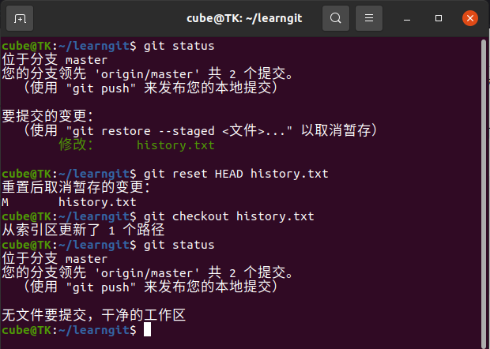
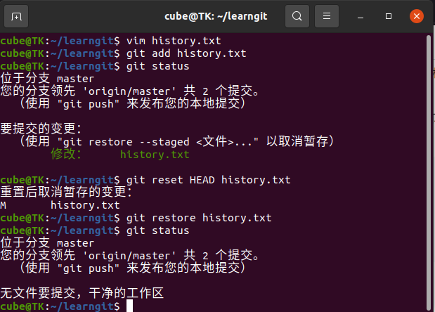
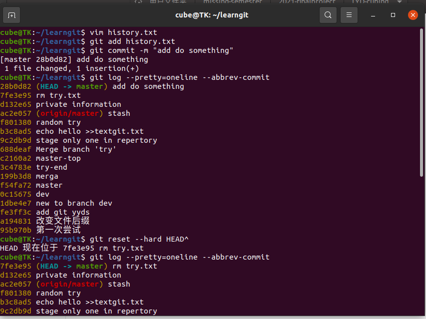
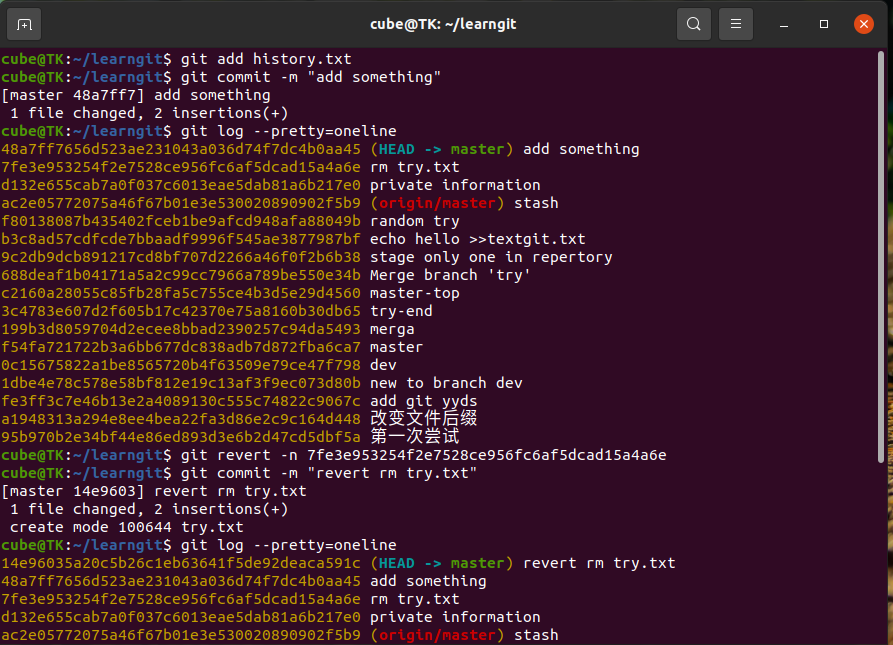
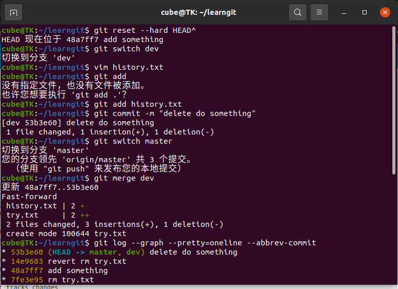
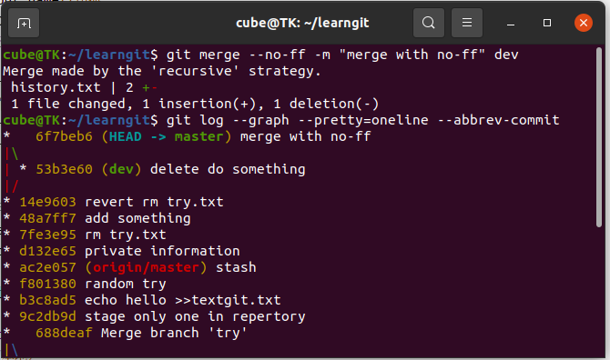

# 一
```1.先 git reset HEAD  <file> 再 git checkout --file```


```2. 先 git reset HEAD  <file> 再 git restore <file>```
 

# 二
``` 1. git reset --hard HEAD^ / git reset --hard commit_id```


``` 2.先 git revert -n commit_id 再 git commit -m " "```


# 三
``` 1. FastForward 删除分支后，会丢掉分支信息: git merge <branch> ```


``` 2. --no-ff强制禁用Fast forward :git merge --no-ff -m "merge with no-ff" dev -->会产生分支信息 ```


