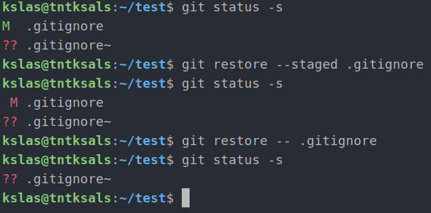
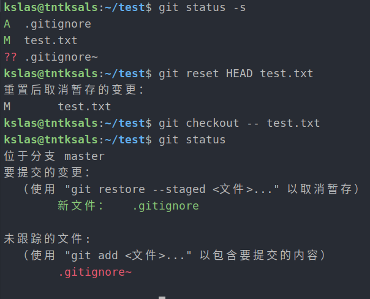
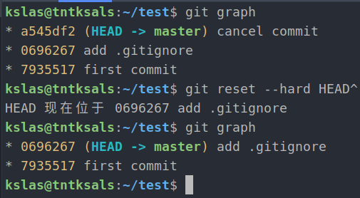
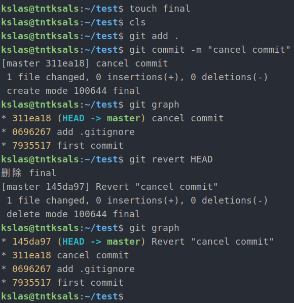
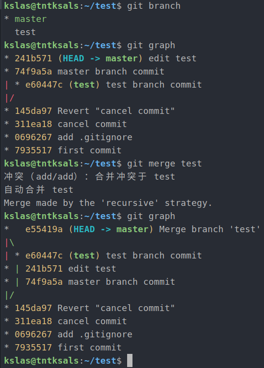
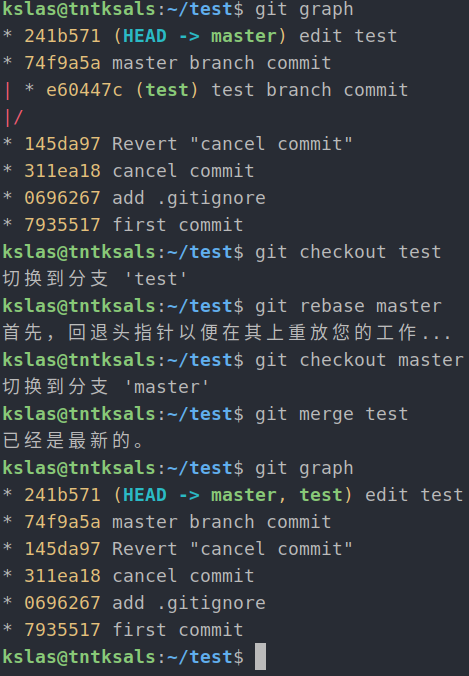

## Git 应用

1. 若你已经修改了部分文件、并且将其中的一部分加入了暂存区，应该如何回退这些修改，恢复到修改前最后一次提交的状态？给出至少两种不同的方式

- 第一种

```bash
git restore --staged <filename> 
git restore -- <filename>
# 适用于修改已暂存的文件
```



- 第二种

```bash
git reset HEAD <filename> 
git checkout -- <filename> 
```



2. 若你已经提交了一个新版本，需要回退该版本，应该如何操作？分别给出不修改历史或修改历史的至少两种不同的方式

- 第一种

```bash
git reset --hard HEAD^
# 回退到上一个版本
# 篡改历史
```



- 第二种

```bash
git revert HEAD 
# 撤回上次提交的内容，再产生一个新的提交
# 在新的提交中，将之前提交的内容反向操作了一遍
```



3. 我们已经知道了合并分支可以使用 merge，但这不是唯一的方法，给出至少两种不同的合并分支的方式

- 第一种

```bash
git checkout <basemaster>
git merge <topicbranch>
# 分叉
```



- 第二种

```bash
git checkout experiment
git rebase master
git checkout master
git merge experiment
# 直线
```


