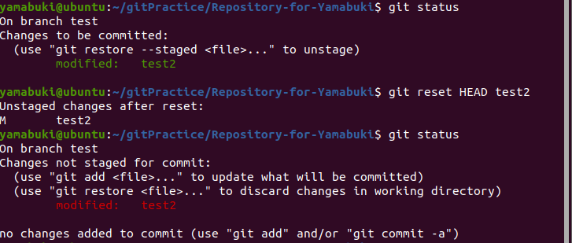
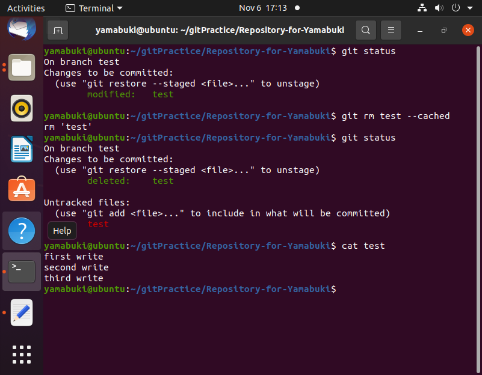

1、若你已经修改了部分文件、并且将其中的一部分加入了暂存区，应该如何回退这些修改，恢复到修改前最后一次提交的状态？给出至少两种不同的方式

Solution1:

此时需使用 git reset HEAD (filename)

则可退回暂存区的修改

若还想退回工作区的修改 则需要在 git reset HEAD (filename) 之后使用 git checkout --(filename) 的操作 或者添加 --hard 参数 因为这里的reset相当于退回该文件到该版本下的状态

Solution2:

git rm filename --cached

这样 便会删除暂存区下的该文件  若想删除工作区的文件 则去掉--cached(缓存)

