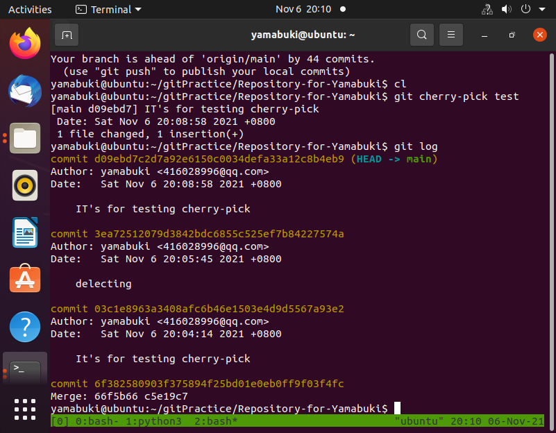
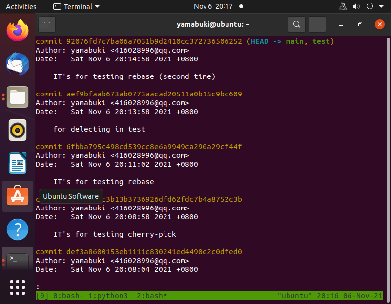

### git中非merge的合并方法:

#### 1: git cherry-pick

git cherry-pick [hash/分支(默认为该分支最后一次提交)]

这个方法是面对单/多次提交的 而非所有提交

#### 2：git rebase

git rebase 分支名字

这个方法会将test分支中的提交记录放在main提交记录后 也就是将不同的提交记录合并 使得提交历史记录更加清晰和整洁