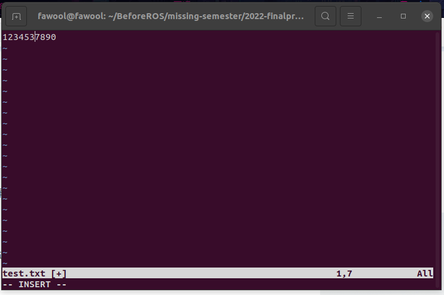
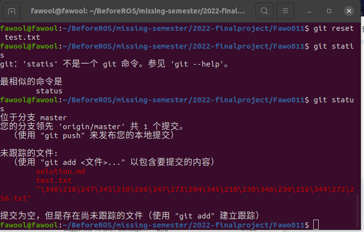
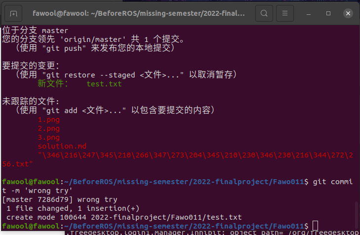
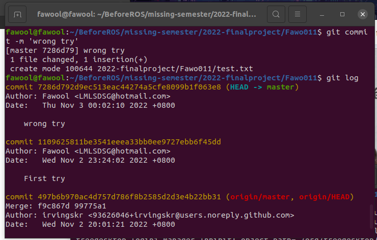
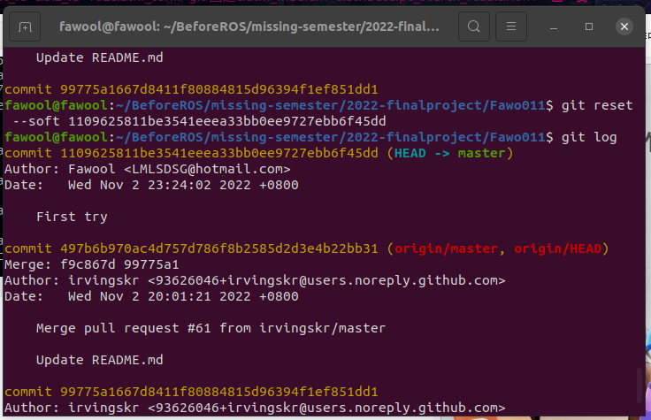
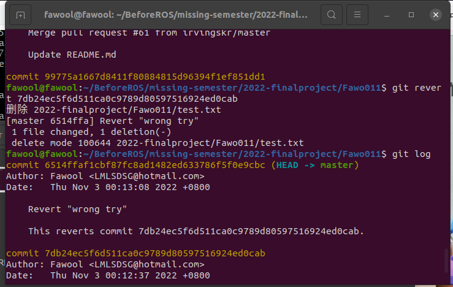
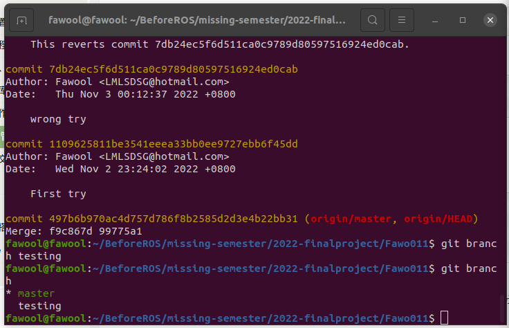

## First question

- 我完成了文件修改

- 我急不可耐地将test添加到暂存区

- 窝草有错误！
- 这时候运行git reset test.txt

- 直接就是将他移出暂存区
**抑或是git reset --hard**

### 总结
1. 使用git reset
2. 使用git reset --hard

## Second question

- 我直接进行了提交
- 
- 确实是有历史的哈
- 
- 这时候先用git reset 不保留原有记录
- 
- 再提交一次后用git revert
- 

### 总结
1. 使用git reset 不保留记录
2. 保留记录使用git revert

## Last question

- 先创建一个分支testing
- 
- 进入master后可使用git merge testing 合并
- 
- 另一种方法，想了很久，只能想到用git cherry-pick命令了合并testing上的某个提交