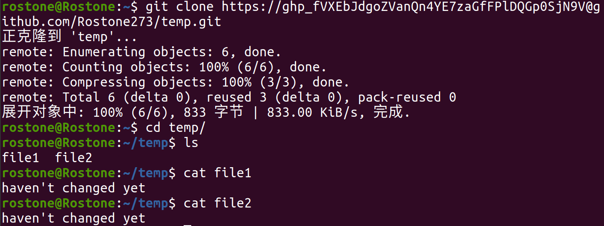
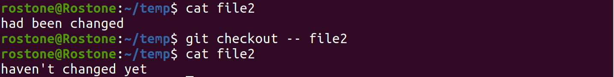
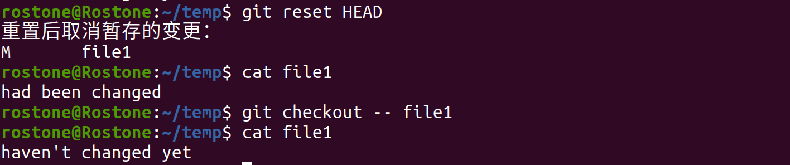
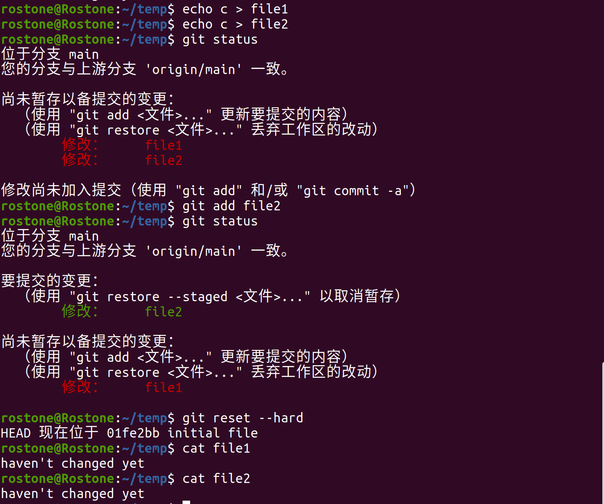
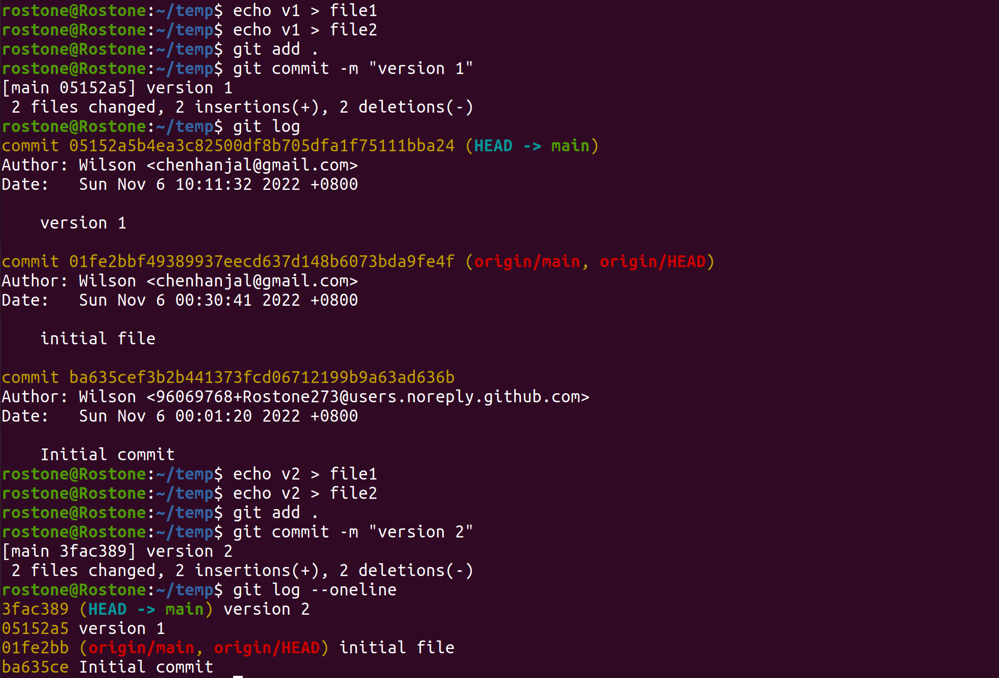
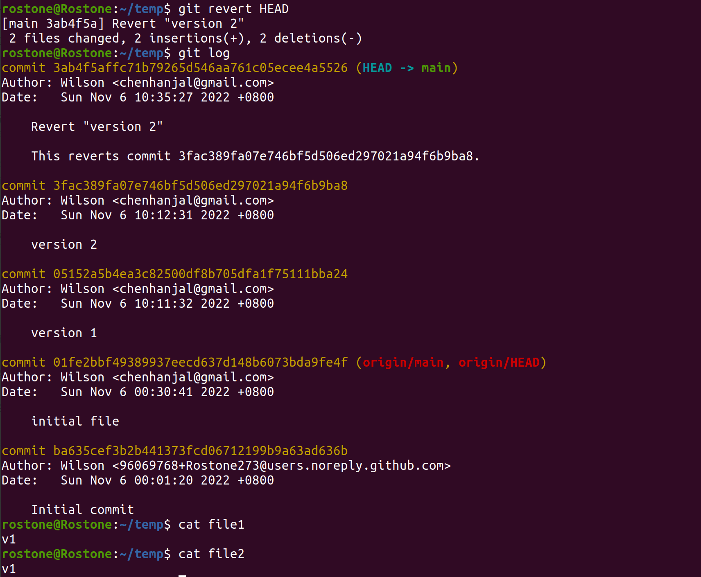
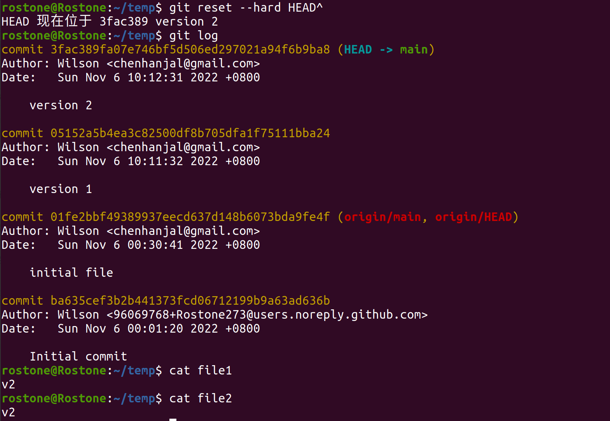
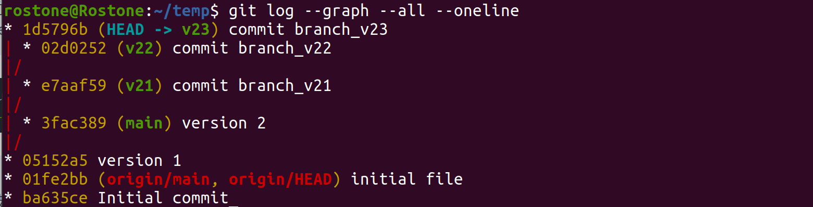

首先，新建了一个仓库并clone到本地作为测试

#### 1.回退暂存区至修改前最后一次提交状态

先修改file1、file2，并将file1加入暂存区

##### 方式1

对未add到暂存区的file2，可以直接使用`git checkout -- filename`进行回退就好了

对于已add到暂存区的file1，需要先使用`git reset`退回HEAD所在版本号（即当前版本号，或者`git reset --soft`也行），再回退工作区的操作

##### 方式2

使用`git reset --hard`一键回退三个区的内容

#### 2.回退版本

先提交两个新的版本

##### 不修改历史

使用`git revert`取之前的版本号进行覆盖

##### 修改历史

使用`git reset --hard`进行一键操作（由于前面新增了个覆盖版本，因此现在将会退回v2）

#### 3.合并分支

先在v1后创建3条分支，现在分支图如图，v21、v22、v23分别只含有branch_v21、branch_v22、branch_v23文件

##### 方式1

使用`git cherry-pick`合并（不过这个实际上并没有合并分支，只是合并了一个提交节点的内容），现在将v21上的文件合并到v22上

##### 方式2

使用`git rebase`合并（机制也不是合并分支，而是合并提交内容），下面将v22的内容合并到v23上（在刚刚方式1已操作的基础上）

(中间红框架内为误操作，无意义)

##### 