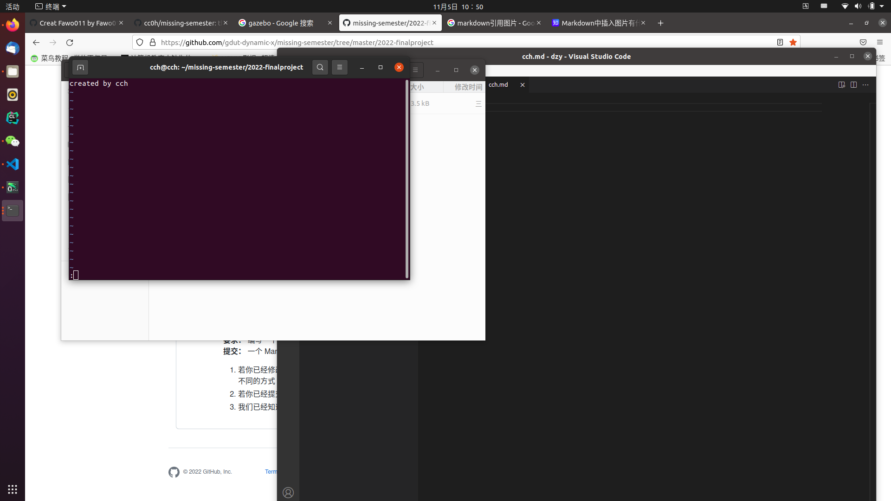
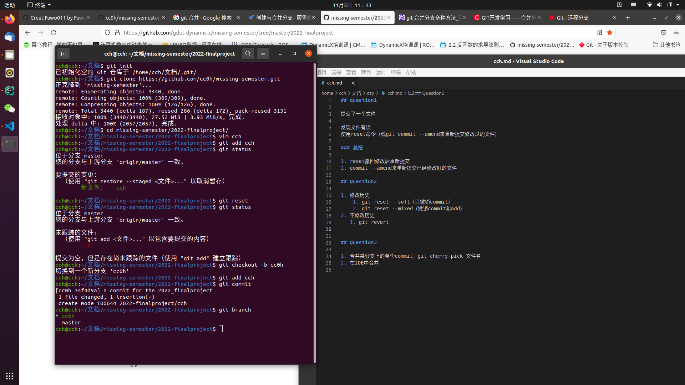
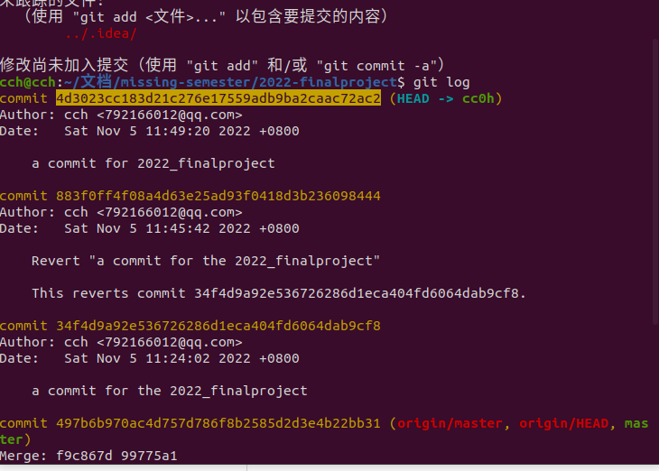
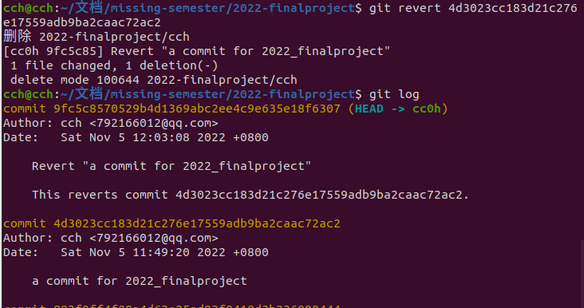
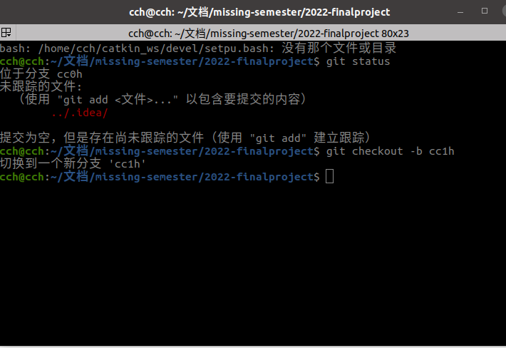
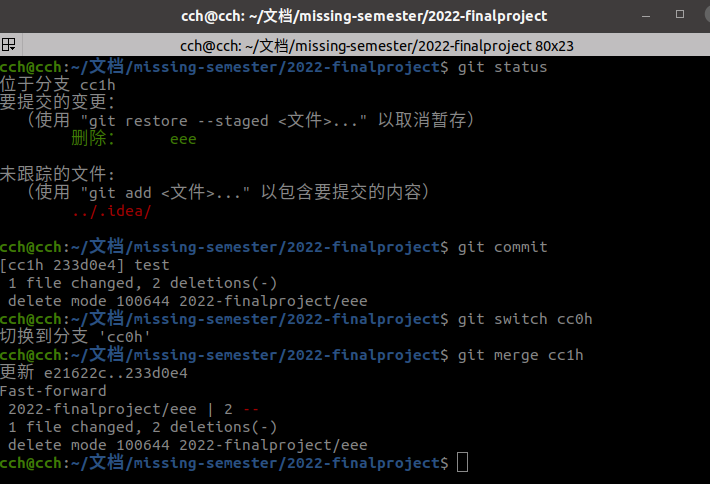

## question1

提交了一个文件

发现文件有误
使用reset命令（reset --hard会把文件一并改动）

### 总结

1. reset撤回修改后重新提交
2. reset --hard(慎用，会把本地文件的修改一起reset)

## Question2

1. 修改历史
    1. git reset --soft（只撤销commit）
    2. git commit --amend
2. 不修改历史
   1. git revert
    
    
    

## Question3

1. 合并某分支上的单个commit：git cherry-pick 文件名
2. 使用git merge ’要被合并的分支名’
    
    
