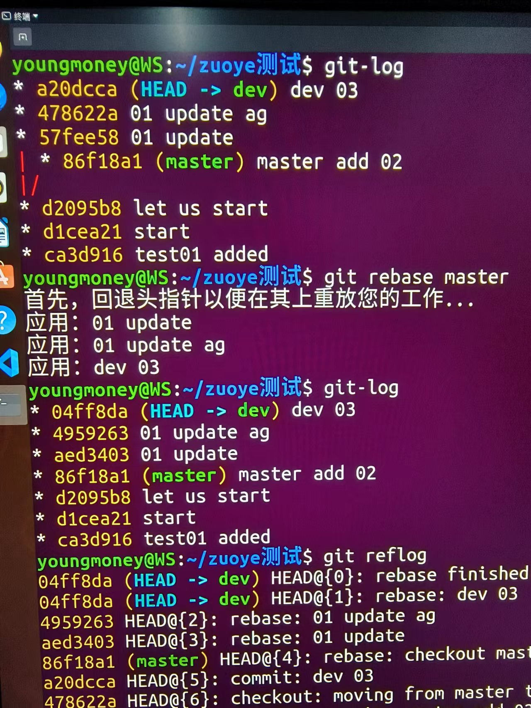
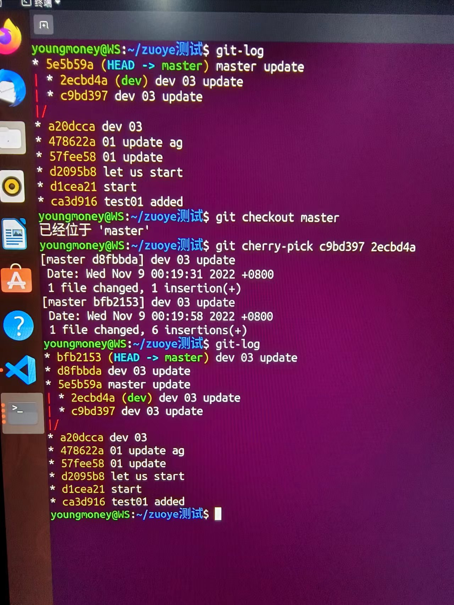

刘宇杰3122000973

1. 若你已经修改了部分文件、并且将其中的一部分加入了暂存区，应该如何回退这些修改，恢复到修改前最后一次提交的状态？给出至少两种不同的方式

-将所有更改加入暂存区并提交，然后
 git reflog  #找到修改前最后一次提交的哈希值（假设为c0），
 git checkout c0  #即可.
 

-将所有更改加入暂存区并提交，然后 
git reflog  #找到修改前最后一次提交的哈希值（假设为c0）， 
git reset --hard c0 #即可.

2. 若你已经提交了一个新版本，需要回退该版本，应该如何操作？分别给出不修改历史或修改历史的至少两种不同的方式

-不修改历史:
git reflog  #找到修改前最后一次提交的哈希值（假设为c0），
git checkout c0

-修改历史:
git reflog  #找到修改前最后一次提交的哈希值（假设为c0）， 
git reset --hard c0

3. 我们已经知道了合并分支可以使用 merge，但这不是唯一的方法，给出至少两种不同的合并分支的方式

-使用rebase:    
(把 dev 分支里的工作直接移到 main 分支上)
git checkout dev
git rebase main  #即可

-使用cherry-pick:
（要把dev分支合并到main）
git reflog   #找到dev分支的历史提交的哈希值，这里假设按照时间顺序为c0,c1,c2 
git checkout main
git cherry-pick c0 c1 c2   #即可

[def]: pic01