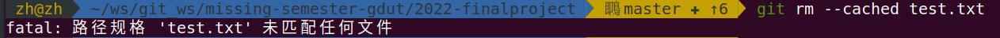
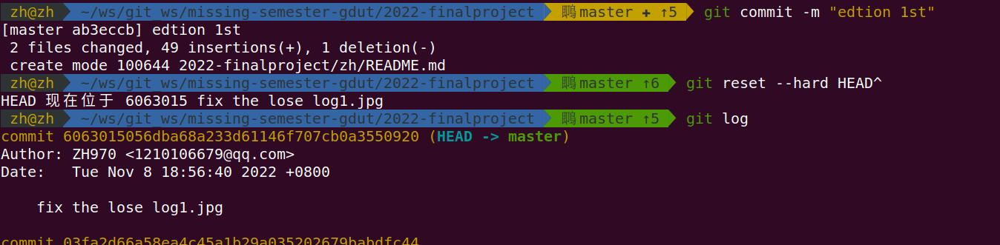
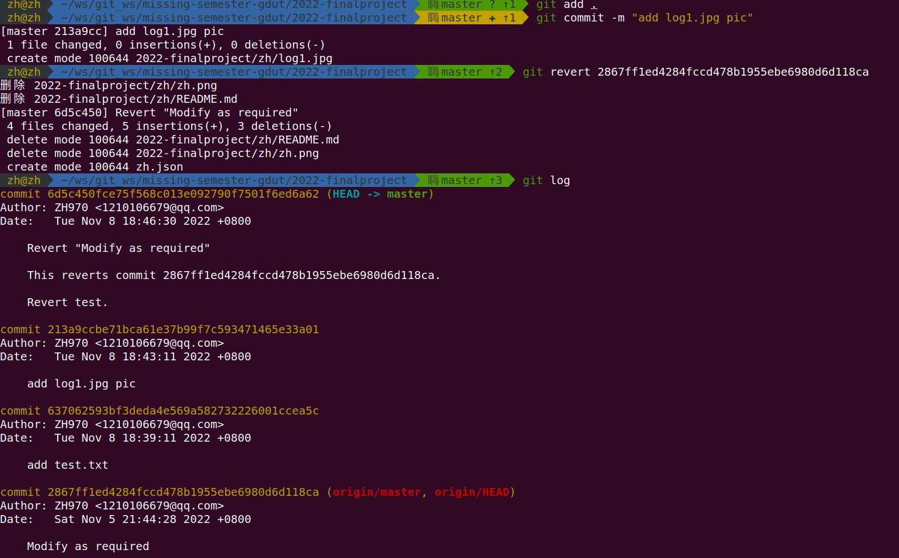
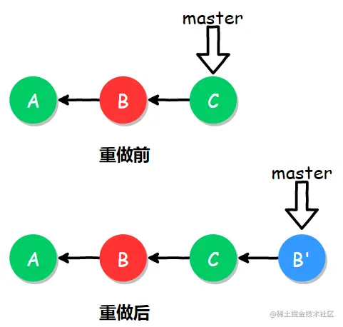
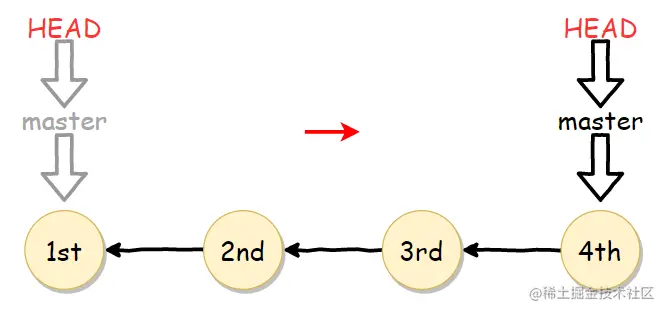
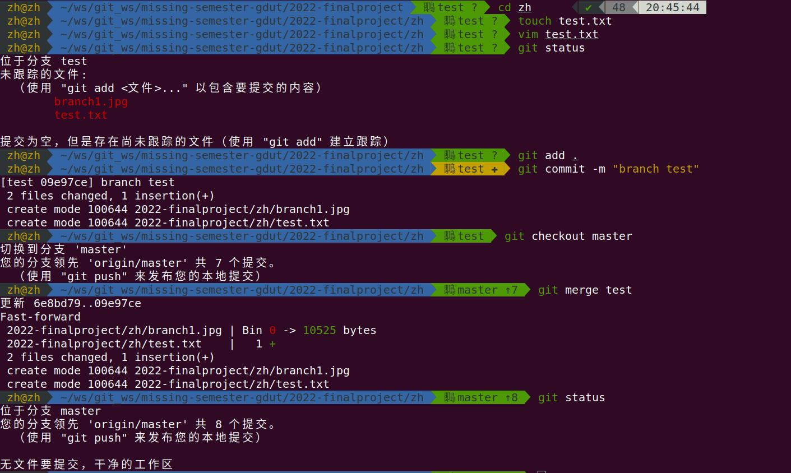
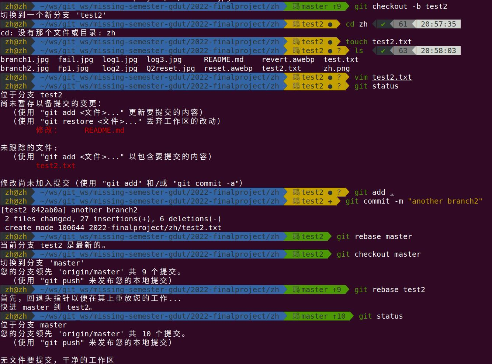
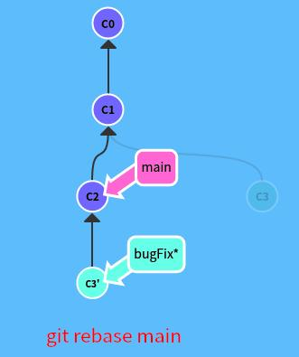

# **张皓的PR**

## *Question 1*

I added something to *index*.
Than I want to  withdrawal and fix it.
So I use :

`git reset .`

Sum：

`git reset` rollback submission can be used together with HEAD ^ (rollback once) and HEAD~n (rollback n times)

`git reset --hard`  will roll back the local files together to the changes before submission (the default reset parameter is -- mix)

also

`git reset --hard <file name>`

It can also withdrawal the content of local file.

(However, actually there is still another way to withdrawal the content in *index*

like `git rm --cached <file name>`. But I fail.

*I didn't use file that contains Chinese but fail. No matching effect on Google.)

## ***Question 2***

Now,I have committed the edition 1st.

But the manager(if he really exited) asked me to withdrawal and fix it.

I decided to use `git reset .`to withdrawal edition.(yeah, it can also withdrawal edition.)

Similarly,

We can use `git revert` to make the same effect.

(The log that I commit:

)

`git revert .` （Having committed, use commit_id to make *revert* point to the specific edition.）

It different form `git reset`,`git reset` 's workflow is :

Sum:

`git reset` is to modify HEAD point.

`git revert` is to renew a submit that is the same as you want to be. 

## ***Question 3***

Create branch:

`git checkout -b <branch name>`

the same as:

`git branch <branch name>`

`git checkout <branch name>`

Than use 

`git merge <branch name>` 

anther way

`git rebase <branch name>`

Sum:

`git merge <branch name>` : The branch which HEAD is located in merge <branch name>

`git rebase <branch name>` :  The branch <branch name> rebase to the branch which HEAD is located in. But rebase can get a clean and linear effect.

